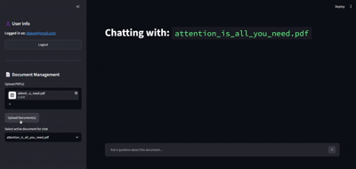
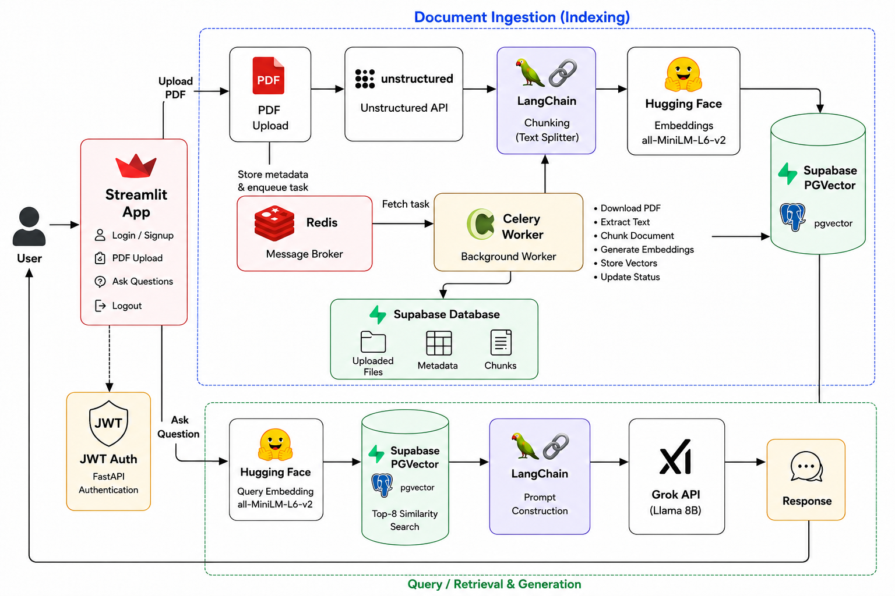

# Research Paper RAG System

A Retrieval-Augmented Generation (RAG) system that enables users to upload research papers and ask natural language questions about their contets.

The Project focuses on evaluating different retrieval pipelines through multiple experiments involving chunking strategies, embedding models, retrieval algorithms, and prompt engineering.

## Demo

<p align="center">
  
</p>

## Table of Contents

- [Overview](#overview)
- [Architecture](#architecture)
- [Docker Architecture](#docker-architecture)
- [Asynchronous Document Processing](#asynchronous-document-processing)
- [Tech Stack](#tech-stack)
- [Project Structure](#project-structure)
- [Installation](#installation)
- [Database Setup](#database-setup)
- [Environment Variables](#environment-variables)
- [Running the Application](#running-the-application)
- [Experiments](#experiments)
- [Evaluation Results](#evaluation-results)
- [License](#license)

# Overview

This project implements a Retrieval-Augmented Generation (RAG) system capable of:

- User authentication with JWT access and refresh tokens
- Uploading research papers to Supabase Storage
- Asynchronous document ingestion using Celery workers
- Parsing and chunking documents using Unstructured
- Generating semantic embeddings
- Storing embeddings in PostgreSQL using pgvector
- Retrieving relevant chunks
- Generating grounded answers using Llama 3.1
- Containerized deployment using Docker and Docker Compose

The project also evaluates multiple retrieval configurations using **Ragas** to identify the most effective RAG pipeline.

# Architecture



# Docker Architecture

The application is containerized using Docker Compose.

Services:

- FastAPI backend
- Streamlit frontend
- Celery worker
- Redis message broker

The backend and frontend communicate over Docker's internal network while Celery processes document ingestion asynchronously.

# Asynchronous Document Processing

Document ingestion is handled asynchronously using Celery.

Uploading a PDF immediately returns control to the user while a background worker:

- Downloads the document
- Parses the PDF
- Chunks text
- Generates embeddings
- Stores vectors in pgvector
- Updates document status

The frontend polls the processing status and automatically updates once ingestion is complete.

This allows multiple documents to be processed concurrently without blocking the API.

# Tech Stack

| Component | Technology |
|------------|------------|
| Backend | FastAPI |
| Background Jobs | Celery |
| Message Broker | Redis |
| Frontend | Streamlit |
| Database | PostgreSQL |
| Containerization | Docker, Docker Compose |
| Vector Database | pgvector |
| Authentication | JWT + Refresh Tokens|
| Storage | Supabase |
| Embedding Model | sentence-transformers/all-MiniLM-L6-v2 |
| LLM | Llama 3.1 (Groq) |
| PDF Parsing | Unstructured |
| Evaluation | Ragas |
| Framework | LangChain |

# Project Structure

```text
app
├── __init__.py
├── auth
│   ├── dependency.py
│   ├── models.py
│   ├── router.py
│   ├── schemas.py
│   ├── service.py
│   └── utils.py
├── celery
│   ├── __init__.py
│   ├── celery_app.py
│   └── tasks.py
├── config.py
├── database.py
├── database_sync.py
├── main.py
└── rag
    ├── models.py
    ├── processor.py
    ├── router.py
    ├── schemas.py
    ├── service.py
    ├── storage.py
    └── vectorstore.py
data/
frontend/
│
├── app.py
└── api.py
notebooks/
results/
```

# Installation

## Clone the repository

```bash
git clone git@github.com:rucha-boraste/research-paper-rag.git

cd research-paper-rag
```

---

## Create a virtual environment

```bash
python -m venv venv
```

Activate it

### Ubuntu

```bash
source venv/bin/activate
```

## Install dependencies

```bash
pip install -r requirements.txt
```

# Database Setup

This project uses **Supabase PostgreSQL** as the relational database and **pgvector** as the vector database extension.

## 1. Create a Supabase Project

1. Go to **https://supabase.com**.
2. Create a new project.
3. Once the project is ready, navigate to:

```
Project Settings → Database
```

Copy the PostgreSQL connection string from the **Session Pooler** section.

## 2. Configure the Database Connection

The application requires two PostgreSQL connection strings.

### DATABASE_URL

Modify the PostgreSQL connection string provided by Supabase by using the **asyncpg** driver.

Example:

```text
postgresql+asyncpg://postgres.<PROJECT_REF>:YOUR_PASSWORD@aws-0-<REGION>.pooler.supabase.com:5432/postgres
```

This connection is used by SQLAlchemy for all database operations.

### PGVECTOR_CONNECTION

Create another connection string using the **psycopg** driver.

Example:

```text
postgresql+psycopg://postgres.<PROJECT_REF>:YOUR_PASSWORD@aws-0-<REGION>.pooler.supabase.com:5432/postgres?sslmode=require
```

This connection is used by LangChain's PGVector integration for vector similarity search.

## 3. Enable pgvector

Open the **SQL Editor** in your Supabase project and execute:

```sql
CREATE EXTENSION IF NOT EXISTS vector;
```

This enables vector storage and similarity search inside PostgreSQL.

## 4. Obtain Remaining Credentials

From your Supabase project, navigate to:

```
Project Settings → API
```

Copy:

- Project URL → `SUPABASE_URL`
- Service Role Key → `SUPABASE_KEY`

These values will be used later in the `.env` file.

# Environment Variables

Create a `.env` file in the project root and add the following variables:

```env
DATABASE_URL=

SUPABASE_URL=

SUPABASE_KEY=

UNSTRUCTURED_API_KEY=

HUGGINGFACEHUB_API_TOKEN=

PGVECTOR_CONNECTION=

GROQ_API_KEY=

JWT_SECRET=

JWT_ALGORITHM=HS256
```

Replace each value with your own credentials before running the application.

# Running the Application (Without docker)

## Build the containers

```bash
docker compose build
```

## Start all services

```bash
docker compose up
```

This starts:

- FastAPI API
- Streamlit frontend
- Celery worker
- Redis

Frontend:

```
http://localhost:8501
```

Backend API:

```
http://localhost:8000
```

# Running the Application (Without docker)

## Redis

Start Redis

```bash
redis-server
```

## Backend

```bash
uvicorn app.main:app --reload
```

Backend runs on

```
http://localhost:8000
```

## Celery Worker

Start a Celery worker

```bash
celery -A app.celery.celery_app.celery_app worker --loglevel=info --concurrency=[Number of workers]
```

## Frontend

```bash
streamlit run frontend/app.py
```

Frontend runs on

```
http://localhost:8501
```

# Experiments

Four retrieval strategies were evaluated.

| Experiment | Description | Context Recall | Faithfulness | Factual Correctness |
|------------|-------------|---------------:|-------------:|--------------------:|
| E1 | Recursive Chunking + MiniLM + Similarity | 0.7139 | 0.6209 | 0.3473 |
| E2 | Unstructured By-Title + Cleaning + Filtering + MiniLM + Similarity | 0.8482 | 0.7523 | 0.4515 |
| E3 | BGE Embeddings + MMR Retrieval | 0.8187 | 0.6699 | 0.4654 |
| E4 | Hi-Res Parsing + Recursive Chunking + Relaxed Filtering + Prompt Refinement + k=8 Retrieval | **0.9000** | **0.7825** | **0.4794** |

# Evaluation Results

The RAG pipelines were evaluated using **Ragas** on a dataset of **50 question-answer pairs**.

Evaluation Metrics:

- Context Recall
- Faithfulness
- Factual Correctness

Experiment 4 achieved the best overall performance by improving chunk quality, retrieval depth, and prompt design.

# Author

**Rucha Boraste**
B.Tech — Computer Engineering
